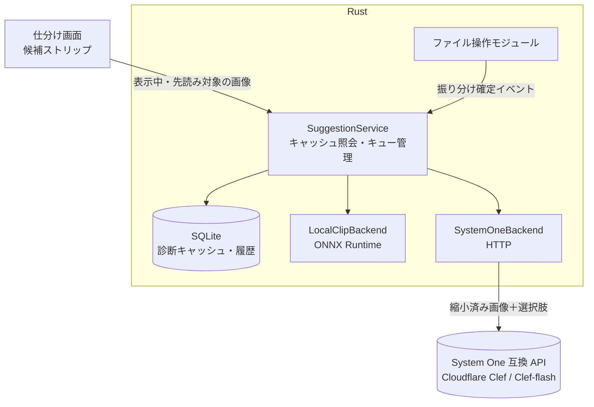

# AI 振り分け候補機能 — 引き継ぎ資料

claude.ai のプロジェクト「画像振り分けアプリケーション」で、2026-10-02 までに詰めた AI 候補提示機能の仕様と経緯をまとめたもの。
**仕様の正本は `docs/requirements.md` の「拡張計画」節**（2026-10-03 時点の最新版に差し替え済み）。この資料は、その背景・決定理由・実装上の注意・未確認事項を補うためのもの。両者が食い違う場合は要件定義書を優先する。

## 0. 位置づけ

- AI 候補提示は **MVP 後の拡張**。手動仕分け（スキャナ / デコーダ / ファイル操作 / 設定管理）が動いてから着手する。
- ただし MVP の段階で、以下は AI 機能を後付けしやすい形にしておくとよい。
  - 振り分け先の設定に任意の `description` 欄を持てる構造（TOML のスキーマ）
  - 「ユーザーがどの画像をどこへ振り分けたか」のイベントをファイル操作モジュールから外へ通知できる口
  - 先読みキュー（表示用の先読みと、AI 診断の先読みを同じ仕組みに乗せられるように）
- **最終決定は常にユーザーのキー操作**。AI が自動でファイルを移動することはない。

## 1. 全体像



バックエンドの出力は「振り分け先と確率（またはスコア）の上位 K 件」に統一し、画面側はバックエンドを意識しない。

| `ai.backend` | 方式 | 画像の外部送信 | スコアの意味 |
| --- | --- | --- | --- |
| `local`（デフォルト） | CLIP 系モデルを ONNX Runtime で端末上実行。ゼロショット＋振り分け済み画像との類似度 | なし | 較正されていない。UI では「一致度」と表記 |
| `systemone` | System One 互換 API（Clef / Clef-flash を優先）。選択肢は「振り分け先一覧＋該当なし」 | あり（同意必須） | モデルが返す確率。ただし較正保証はない前提で扱う |
| `off` | AI 機能なし | なし | — |

## 2. 決定事項と、そう決めた理由

経緯を知らずにリファクタすると壊しやすいところなので、理由も残しておく。

| 決定 | 理由・経緯 |
| --- | --- |
| デフォルトは `local`、`systemone` は明示的に有効化したときだけ | 画像を外部に出さないことを基本にしたいという開発者の方針 |
| 外部バックエンドは「System One 互換クライアント」1 本にし、エンドポイントとモデル名の差し替えで接続先を変える | Clef は System One API に準拠しており、Jev と同じ state＋questions 形式が使えるため |
| TypeSafe の Jev は対象外 | Jev はテキスト入力のみで画像を受け付けない。当初は「ローカルで画像をテキスト化→Jev」の二段構成も検討したが、画像を直接読める Clef 系が見つかったので不採用。Jev が将来画像対応すれば同じクライアントで乗れる |
| 診断は 1 画像につき 1 回。キャッシュと履歴を SQLite に残す | API コスト低減のため（開発者の要望） |
| キャッシュのキーはファイルパスではなく中身のハッシュ（BLAKE3 など） | 振り分けで移動・改名しても、別フォルダから開き直しても再診断しないため |
| 1 画像 1 リクエスト。複数画像を束ねない | 課金は入力トークン単位なので束ねても安くならない。Clef は 1 リクエスト 4 枚までで、束ねると画像の取り違えの恐れもある。同じ画像への複数の質問だけは 1 リクエストにまとめてよい（将来「不要画像か」等を足す場合） |
| 振り分け先を追加しても自動再診断しない。必要な画像だけキー操作で再診断 | 「1 画像 1 回」を守るため。当初は一括再診断ダイアログ案があったが、束ねてもコストが下がらないため廃止し、1 枚ずつの再診断に変更 |
| 再診断キーは Ctrl+Shift+D（設定で変更可） | 開発者が Ctrl+Shift の組み合わせを指定。WebView2・IBus と衝突しないキーとして D を選定（§6） |
| 確率の 3 段階は「高：強調表示／中：候補表示／低：非表示」 | 当初は「高：一括確認画面で自動選択」だったが、一括確認画面を当面設けないことにしたため変更 |
| しきい値はバックエンドごとに別々に持つ | local のスコアと systemone の確率は尺度が違うため |
| 一括確認画面は当面作らない | 将来案としてモックのみ残す（未決事項） |

## 3. バックエンド別の仕様

### 3.1 local（CLIP / ONNX Runtime）

- 候補クレート：`ort`、`open_clip_inference`（要件定義書の技術構成表より）。採用前に最新の API・対応モデルを確認すること。
- `strategy`：
  - `zeroshot`：振り分け先の `description`（なければフォルダ名）をテキスト埋め込みにし、画像埋め込みとの類似度で採点
  - `knn`：その振り分け先へ実際に振り分けられた画像の埋め込みとの近さで採点（使うほど精度が上がる）
  - `hybrid`：両者を組み合わせる（デフォルト）。重み付けは未決なので実データで調整
- 画像の埋め込みベクトルもキャッシュする。これにより、振り分け先を追加したときはテキスト側だけ計算して**リクエストなし・その場で**採点し直せる。
- スコアは較正された確率ではないので、UI では「一致度」と表記し、確率と区別する。
- **未決：日本語対応**。フォルダ名は日本語が中心。日本語対応の CLIP 系モデルを選ぶか、フォルダごとの英語 `description` で補うか。ONNX で動かせるモデルの有無とサイズ（軽量性の要件）を調べて開発者に提案すること。

### 3.2 systemone（Cloudflare Clef / Clef-flash）

以下は 2026-10-03 に Cloudflare の公式モデルページと入力スキーマで確認した内容。実装時に再確認すること。

- エンドポイント：`https://api.cloudflare.com/client/v4/accounts/{account}/ai/run/@cf/cloudflare/clef-flash`（Clef は末尾が `clef`）。認証は Workers AI 権限付きの Cloudflare API トークン。
- リクエストは `model`・`state`・`questions` が必須。`model` は `clef` または `clef-flash` で、**エンドポイントのモデルと一致させないと 400 エラー**になるという報告がある。
- `questions` は 1〜64 問。型は noul / choice / score。choice の選択肢は 2〜255 個。
- 画像は Clef 独自拡張の `images` 配列（最大 4 枚）に、base64 の data URL か `{content_type, base64}` で渡す。PNG / JPEG / WebP のみ、**リモート URL は不可**。1 枚 4 MiB・16 メガピクセルまで、デコード後合計 8 MiB、リクエスト全体 13 MiB まで。
- Lumiwake での使い方：
  - 1 画像につき choice 型の質問 1 問。選択肢は「現在の振り分け先一覧＋該当なし」。各振り分け先の `description` を指示文側に含める。
  - 送信前に縮小・JPEG 再圧縮する（`max_image_kb = 190` が目安。画像リクエストは 13〜30 秒かかったという報告があり、その際に約 190KB 以下が推奨されていた）。
  - 表示中の数枚先（`prefetch`）まで先読みして診断し、キャッシュに入れておく。
- 送った選択肢の一覧は履歴に記録する（追加されたフォルダが「未評価」かの判定に使う）。
- 安全面：
  - 初めて有効にするとき、画像が外部へ送信されることを明示して同意を取る。
  - フォルダ単位で外部送信を除外できる。
  - API キーは設定ファイルに直接書かず、環境変数（`api_key_env`）または OS のキーチェーンから読む。
- 参考情報（採用はしていない）：Clef / Clef-flash は Apache 2.0 のオープンウェイトで、Clef-flash は GGUF 版もあり自前ホストも可能。エンドポイント差し替えで将来対応できる。

## 4. 診断キャッシュと履歴

保存先はアプリのデータフォルダ内の SQLite（`rusqlite`）。以下のテーブル構成は**引き継ぎ時点の案**で、必要に応じて変えてよい。

```sql
-- 診断 1 回 = 1 行。再診断しても上書きせず追加し、is_latest を付け替える
CREATE TABLE diagnoses (
  id            INTEGER PRIMARY KEY,
  image_hash    TEXT NOT NULL,      -- BLAKE3（ファイル内容）
  diagnosed_at  TEXT NOT NULL,      -- ISO 8601
  backend       TEXT NOT NULL,      -- 'local' | 'systemone'
  model         TEXT NOT NULL,
  choices_json  TEXT NOT NULL,      -- 渡した選択肢（振り分け先の識別子の配列）
  scores_json   TEXT NOT NULL,      -- 選択肢ごとの確率／一致度
  is_latest     INTEGER NOT NULL DEFAULT 1
);
CREATE INDEX idx_diag_hash ON diagnoses(image_hash, backend, is_latest);

-- local 用：画像埋め込み
CREATE TABLE embeddings (
  image_hash TEXT NOT NULL,
  model      TEXT NOT NULL,
  vector     BLOB NOT NULL,
  PRIMARY KEY (image_hash, model)
);

-- ユーザーが最終的に振り分けた先（knn の手本・的中率表示に使う）
CREATE TABLE outcomes (
  image_hash   TEXT NOT NULL,
  destination  TEXT NOT NULL,       -- 振り分け先の識別子
  decided_at   TEXT NOT NULL
);
```

振る舞いのルール（要件定義書より）：

- 先読みで診断した結果もキャッシュに入れ、表示時に二重のリクエストを出さない。スキップした画像の結果も残す。
- モデルを更新しても自動では再診断しない。
- 振り分け先を**削除**したら、キャッシュの確率から外して残りで正規化し直す（リクエストなし）。
- `outcomes` は Undo されたら取り消す必要がある。ファイル操作モジュールの Undo と整合させること。
- 振り分け先の識別子をフルパスにするか別の ID にするかは未決。フォルダの改名・移動時の扱いと合わせて決める。

## 5. 画面

AI 候補を有効にしたときの仕分け画面は、バックエンドによらず「候補ストリップ型」。

- プレビューの下に上位 K 件の候補カード。カードには割り当てキー、フォルダ名、フルパス、スコアを表示。右側には細いキー割り当て一覧。
- 高しきい値以上の候補は強調表示、中は通常表示、低は表示しない。
- `systemone` では「該当なし」カードを加え、Space（スキップ）に対応させる。
  - ⚠ この Space への対応づけは、モック作成時に Claude が置いた仮定がそのまま要件に入ったもので、開発者の明示的な確認は取れていない。実装前に確認すること。
- 未評価の振り分け先があるとき（`systemone` のみ）、プレビューと候補カードの間に「新しい振り分け先が未評価です［Ctrl+Shift+D］再診断」と小さな帯を出す。モーダルにしない。
- 設定画面の「AI 候補」：バックエンド選択／ローカル設定（モデル・方式・しきい値）／System One 互換 API 設定（エンドポイント、API キーの環境変数名と検出状態、画像の上限サイズ、しきい値、接続テスト、外部送信への同意状態）／共通設定（候補数・先読み枚数）／振り分け先ごとの説明文・的中率・外部送信の除外／再診断キー／診断履歴。
- 画面モック：`docs/ui-mockups/ai/`（静的 HTML。説明は同フォルダの `README.md`）。元は claude.ai 上の https://claude.ai/artifact/BQ7CRL178VpF1VZYt2TUdZ
  - 以前の引き継ぎで渡した `docs/ui-mockups/A-sidebar.html` の AI 候補パネルと `C-batch-review.html` は**古い案**。AI 有効時の画面は上記の候補ストリップ型が正しい。

## 6. キー割り当て

- 再診断：Ctrl+Shift+D（デフォルト、`[keys] rediagnose` で変更可）。表示中の 1 枚だけを再診断する。
- `tauri-plugin-prevent-default` で WebView 由来の再読み込み・検索・印刷などのショートカットを無効化し、Windows ではブラウザのアクセラレータキーもオフにする。デバッグビルドでは開発者ツールのキーだけ残す。
- Ctrl+Shift で避けるキー：G・I・R・P（WebView2）、U・E（Linux の IBus / GTK）。
- 起動時に Lumiwake 内のキー割り当て同士の重複を調べ、重複があれば警告する。

## 7. 設定例（TOML、値は仮）

```toml
[ai]
backend = "local"        # "local" | "systemone" | "off"
top_k = 3
prefetch = 5

[ai.local]
model = "clip-vit-b32"
strategy = "hybrid"      # zeroshot / knn / hybrid
high = 0.80
low = 0.40

[ai.systemone]
endpoint = "https://api.cloudflare.com/client/v4/accounts/{account}/ai/run/@cf/cloudflare/clef-flash"
api_key_env = "LUMIWAKE_SYSTEMONE_KEY"
max_image_kb = 190
high = 0.85
low = 0.50

[keys]
rediagnose = "Ctrl+Shift+D"
```

振り分け先ごとの `description`・外部送信除外のキー名はまだ決めていない。MVP の振り分け先設定のスキーマに合わせて決める。

## 8. 実装順の提案

1. `Suggester` トレイト（入力：画像ハッシュ＋デコード済み画像＋振り分け先一覧、出力：上位 K 件）と、`off` 実装・テスト用のダミー実装
2. SQLite キャッシュ（`diagnoses` / `outcomes`）と `SuggestionService`（キャッシュ照会・先読みキュー・is_latest 管理）。ファイル操作の Undo と `outcomes` の整合をテストで固める
3. 候補ストリップの UI（ダミー実装で表示確認）
4. `local`：モデル選定 → ゼロショット → 埋め込みキャッシュ → knn / hybrid
5. `systemone`：縮小・再圧縮、リクエスト組み立て、同意フロー、送信除外、キー読み出し、接続テスト
6. 再診断（Ctrl+Shift+D）・未評価の帯・キー衝突対策
7. 設定画面の AI 項目、的中率と診断履歴の表示

## 9. テスト・開発時の注意

- 実在の写真フォルダは使わず、一時ディレクトリに生成したダミー画像で試す（MVP と同じ方針）。
- 自動テストから外部 API を叩かない。`systemone` は HTTP をモックしてテストし、実 API での確認は開発者の API キーで手動で行う。
- 外部 API のレスポンス形（`answers` や `usage` の構造）は公式ドキュメントで確認してから型を書く。推測で決め打ちしない。
- ONNX モデルや ORT のネイティブライブラリを配布物に含めるかは、軽量性の要件と照らして開発者に相談する（HEIC/AVIF と同じく「重ければプラグイン扱い」の方針が参考になる）。

## 10. 未決事項・未確認事項

- [ ] ローカルで使う日本語対応 CLIP 系モデルの選定（または英語 `description` で補う方針）
- [ ] `hybrid` の重み付け、各しきい値の実データでの調整
- [ ] 「該当なし」カードを Space に対応させてよいか（開発者未確認）
- [ ] 振り分け先の識別子（フルパスか ID か）と、フォルダ改名・移動時のキャッシュの扱い
- [ ] Clef のレスポンスの正確な形、リクエストごとの固定トークン量（Jev では約 260 トークンと計測されていたが、Clef では未確認）
- [ ] OS キーチェーンからの API キー読み出しに使うクレート
- [ ] 一括確認画面を将来導入するか（導入する場合の高しきい値の役割を含む）
- [ ] ONNX モデル・ランタイムの配布方法

## 参考リンク

- Clef（Workers AI）：https://developers.cloudflare.com/workers-ai/models/clef/
- Clef-flash（Workers AI）：https://developers.cloudflare.com/workers-ai/models/clef-flash/
- tauri-plugin-prevent-default：https://github.com/ferreira-tb/tauri-plugin-prevent-default
- ort：https://docs.rs/crate/ort
- open_clip_inference：https://docs.rs/crate/open_clip_inference/latest/source/README.md
