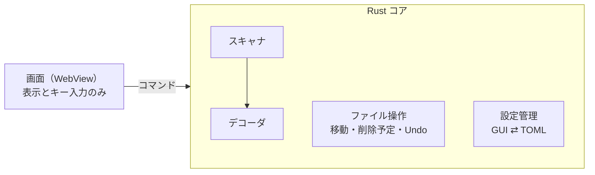

# 画像振り分けアプリ 要件定義書

最終更新：2026-10-03（claude.ai の要件定義書から書き出し）

## 概要

画像を1枚ずつ目で確認し、キー操作でフォルダへ高速に仕分けるデスクトップアプリを作る。数百枚単位の画像を、手作業より速く、押し間違えても安全に戻せる形で整理することが目的である。

- 対象ユーザー：開発者本人（個人利用）
- 想定規模：1回の作業で数百枚程度
- 動作環境：Windows と Linux の両方
- 仕分け元：ローカルフォルダと SMB 共有フォルダ

## スコープ

MVP はキー操作による手動仕分けに集中し、AI による振り分け候補の提示は拡張計画に回す。

| 区分 | 内容 |
| --- | --- |
| MVP | 画像表示、キーでの移動・スキップ・削除、キー設定（GUI/TOML）、複数段 Undo、同名ファイルの比較処理、ローカル/SMB 対応 |
| 拡張計画 | AI による振り分け先候補の提示（日本語フォルダ名対応） |
| 対象外 | RAW 画像、動画、EXIF 等のメタデータによる自動振り分け、全自動仕分け |

## 機能要件

### 読み込み

- 仕分け元フォルダを指定して画像を読み込む。サブフォルダを含めるかは都度選択できる。
- 振り分け先フォルダと削除フォルダ（指定時）は、スキャン対象から自動で除外する。
- 対応形式：JPEG、PNG、WebP、GIF、BMP、TIFF、AVIF、HEIC を最低限とし、形式ごとにデコーダを追加できる構成にする。

### 表示

- 画像を1枚ずつ表示し、現在位置（何枚目／全体枚数）を示す。
- 次の数枚を先読みし、SMB 上でも切り替えの待ち時間を出さない。

### 仕分け操作

| 操作 | 動作 |
| --- | --- |
| 振り分けキー | 割り当てたフォルダへファイルを移動し、次の画像へ進む |
| スキップ | ファイルを動かさず次へ進む（保留） |
| 削除 | 削除フォルダ指定時はそこへ移動、未指定時は元の場所のまま削除予定として記録する（ローカル/SMB 共通） |
| Undo | 直前の操作から順に、複数回さかのぼって取り消す（履歴はアプリ起動中のみ保持し、再起動後には引き継がない） |

### キー設定

- 振り分けキーは Ctrl／Shift／Alt との組み合わせに対応し、多数のフォルダを割り当てられる。
- 設定は GUI の設定画面と TOML ファイルの両方で編集でき、GUI の変更は TOML に書き出す。
- 重複したキーや、アプリ・WebView の予約キーとの衝突を設定時に警告する。

### 削除の扱い

- SMB 上の削除は OS のごみ箱に入らず完全削除になるため、削除キーを押した時点ではファイルを消さない。
- 削除フォルダが設定で指定されている場合：削除キーでそのフォルダへ移動する。
- 削除フォルダが未指定の場合：ファイルは元の場所に置いたまま「削除予定」として記録し、以降の表示から外す。
- どちらの場合も Undo で削除を取り消せる（移動を戻す／削除予定を外す）。

* アプリ終了時、削除予定のファイル（削除フォルダ内のもの、または元の場所で削除予定とされたもの）を完全削除するかユーザーに確認する（既定）。
* 設定で「終了時に確認する」「確認せずにそのまま削除する」を切り替えられる。
* 確認ダイアログから削除フォルダ、または削除予定ファイルの一覧とその置き場所を開き、中身を確かめてから削除できる。
* 削除予定の記録は起動中のみ保持するため、異常終了した場合はファイルが元の場所に残る（消えはしない）ため、仕分けをやり直す。記録のファイル保存は行わない。

### 同名ファイルの処理

- 移動先に同名ファイルがある場合、両方の画像を並べて表示する。
- ユーザーは「既存を残す」「上書き」「両方残す（移動するファイルをリネーム）」「スキップ（今回は移動しない）」から選ぶ。

## 非機能要件

| 項目 | 要件 |
| --- | --- |
| 対応 OS | Windows と Linux（デスクトップ環境あり）で同じ機能が動く |
| 軽量性 | 常駐せず、起動と画像切り替えが軽いこと。配布物のサイズを抑える |
| 操作性 | キーボードだけで仕分けが完結する |
| 安全性 | 別ドライブ間の移動（コピー後に元を削除）が途中で失敗しても、ファイルの欠損や重複を残さない |
| 追跡性 | 移動・削除の操作履歴を保持し、Undo の根拠にする |

## 技術構成案

Tauri（Rust ＋ WebView）で作り、画像デコードとファイル操作はすべて Rust 側に置く。



画面はキー入力をコアへ渡すだけで、移動・削除待ち・Undo の整合性はファイル操作モジュールが一手に持つ。

| 役割 | 候補 | 確認した点 |
| --- | --- | --- |
| アプリ基盤 | Tauri | 軽量性と WebView の予約キーの扱いは実装前に要確認 |
| 画像デコード | [image](https://github.com/fintelia/image) | 標準機能で JPEG・PNG・GIF・WebP・BMP・TIFF などをデコード可能。AVIF は avif-native 機能と C ライブラリ libdav1d が必要 |
| HEIC デコード | [libheif-rs](https://docs.rs/crate/libheif-rs/latest) | Linux は pkg-config、Windows は vcpkg で libheif を用意する。Windows ビルドに手間がかかる |
| AI 推論（拡張） | [ort](https://docs.rs/crate/ort) / [open\_clip\_inference](https://docs.rs/crate/open_clip_inference/latest/source/README.md) | ONNX Runtime で CLIP 系モデルを端末上で実行できる。外部の System One 互換 API は HTTP クライアントで呼び、診断キャッシュは rusqlite で保存する |

SMB 共有上での削除は OS のごみ箱に入らず完全削除になる（[参考](https://cat.pdx.edu/platforms/windows/file-disk/recycle-bin/)）。このため削除キーではファイルを即時に消さず、削除フォルダへの移動または削除予定の記録で扱う。

配布方針：HEIC・AVIF のデコード用ライブラリは、軽量性を保てる範囲なら同梱する。配布物が重くなる場合はプラグイン扱いとし、利用者が用意したライブラリをわかりやすい所定の場所（例：アプリ設定フォルダ内の plugins）に置けば有効になるようにする。未導入の形式は読み込み時にスキップし、その旨を表示する。

## 開発・リリース運用

ソースコードは GitHub で管理し、バージョンを上げるたびに GitHub Actions でパッケージを作って Release に載せる。

| 項目 | 方針 |
| --- | --- |
| リポジトリ | GitHub で管理する |
| パッケージング | Release は開発者が手動で作成する。Release の公開を契機に GitHub Actions で Windows・Linux 向けパッケージをビルドし、その Release に添付する |
| 配布 | ビルドしたパッケージを GitHub Releases に添付して配布する |
| 説明ページ | ツールの紹介・使い方・インストール手順・キー設定例などを、日本語と英語で GitHub Pages に公開する。Astro のドキュメント用テーマ [Starlight](https://github.com/withastro/starlight) で作る（多言語対応と GitHub Pages へのデプロイ手順が公式に用意されている） |

ビルドには Tauri 公式の [tauri-action](https://github.com/tauri-apps/tauri-action) を使う想定。Windows・Linux 向けのネイティブバイナリをビルドし、既存の Release へのパッケージのアップロードにも対応している。出力は .msi（Windows）、.deb・.AppImage（Linux）など。

HEIC・AVIF のライブラリを同梱する場合は、CI 上でも libheif・libdav1d を用意する手順が必要になる（Windows は vcpkg など）。

### 自動アップデート

- Tauri の updater プラグインを使い、起動時などに GitHub Releases 上の `latest.json` を確認して新しいバージョンを取得・インストールする。
- 更新ファイルには署名が必須。秘密鍵は GitHub Actions のシークレット（`TAURI_SIGNING_PRIVATE_KEY`）に置き、公開鍵はアプリの設定に埋め込む。
- 署名鍵は一度決めたら変えない。変えると、配布済みのバージョンが更新できなくなる。
- リリースのワークフローで、署名付きの更新ファイルと `latest.json` も Release に添付する。

## 拡張計画

MVP の後、表示中の画像に対して AI が振り分け先フォルダの候補を提示する。最終決定は常にユーザーのキー操作で行う。

- 方式：CLIP 系モデルで、フォルダ名をラベルとしたゼロショット分類を行う。フォルダ内の既存画像を手本にして精度を上げる方式も検討する。
- 日本語対応：フォルダ名は日本語が中心のため、日本語に対応したモデルを選ぶか、フォルダごとに英語の説明文を設定できるようにする。
- 待ち時間：読み込み時の一括判定または先読みにより、表示のたびに判定を待たせない。
- 実行場所：アプリ単体（端末上）のローカル推論をデフォルトとし、外部の判断モデル API は設定で明示的に有効にしたときだけ使う。

### 推論バックエンド

候補提示のバックエンドは設定で切り替える。デフォルトはローカルで、どちらも出力は「振り分け先と確率の上位 K 件」に統一し、画面側はバックエンドを意識しない。

| 設定値 | 方式 | 画像の送信 | 備考 |
| --- | --- | --- | --- |
| `local`（デフォルト） | CLIP 系モデルを ONNX Runtime で端末上実行。ゼロショットと、振り分け済み画像との類似度を併用 | なし | スコアは較正された確率ではない |
| `systemone` | System One 互換 API（Cloudflare Clef / Clef-flash など）。選択肢は「振り分け先一覧＋該当なし」 | あり（縮小・再圧縮して送る） | エンドポイントとモデル名の差し替えで接続先を変える |
| `off` | AI 機能なし | なし |  |

- 振り分け先ごとに任意の説明文（`description`）を持たせ、両方式で使う。ラベル名より、何を入れるフォルダかの条件を書く。
- 確率は「高：候補カードを強調表示」「中：候補として表示」「低：表示しない」の3段階で扱う（一括確認画面を設けないため、当初の「高：一括確認画面の自動選択」から変更）。しきい値はバックエンドごとに別に持つ。
- `systemone` を初めて有効にするとき、画像が外部へ送信されることを明示して同意を取る。フォルダ単位で送信を除外できるようにする。
- API キーは設定ファイルに直接書かず、環境変数または OS のキーチェーンから読む。
- 外部 API は画像の判定に十数秒かかる報告があるため、表示中の数枚先まで先読みして候補を用意する。
- TypeSafe の Jev はテキスト入力のみのため、現時点では対象外とする。画像対応すれば同じ System One 互換クライアントで接続できる。

### 画面構成

AI 候補を有効にしたときの仕分け画面は、バックエンドによらず「候補ストリップ型」を使う。

- 仕分け画面：プレビューの下に上位 K 件の候補カードを並べる。カードには割り当てキー、フォルダ名、フルパス、スコアを表示する。右側には細いキー割り当て一覧を置く。
- `local` のスコアは較正された確率ではないため「一致度」と表記し、確率と区別する。
- `systemone` では「該当なし」のカードを加え、Space（スキップ）に対応させる。
- 未評価の振り分け先があるときの再診断の案内は、プレビューと候補カードの間に帯で表示する。
- 設定画面の「AI 候補」には、次の項目を置く。
  - バックエンドの選択
  - ローカルの設定（モデル、方式、しきい値）
  - System One 互換 API の設定（エンドポイント、API キーの環境変数名と検出状態、画像の上限サイズ、しきい値、接続テスト、外部送信への同意状態）
  - 共通設定（候補数、先読み枚数）
  - 振り分け先ごとの説明文、的中率、外部送信の除外
  - 再診断キー
  - 診断履歴
- 一括確認画面：当面は設けない。将来案としてモックを残す。

画面モック：[Lumiwake AI振り分け 画面モック](https://claude.ai/artifact/BQ7CRL178VpF1VZYt2TUdZ)

### 診断キャッシュと履歴

リクエストのコストを抑えるため、診断は1画像につき1回とし、結果をキャッシュして履歴を残す。

- キーはパスではなく画像ファイルの中身のハッシュ（BLAKE3 など）とする。移動・改名・別フォルダからの読み込みでも再診断しない。
- 保存先はアプリのデータフォルダ内の SQLite（rusqlite）。
- 記録項目：ハッシュ、診断日時、バックエンド種別とモデル名、渡した選択肢の一覧、各選択肢の確率、ユーザーが最終的に振り分けた先。
- 先読みで診断した結果もキャッシュに入れ、表示時に二重のリクエストを出さない。スキップした画像の結果も残す。
- モデルを更新しても自動では再診断しない。
- 再診断しても前の結果は消さず、新しい行を追加して「最新」の印を付け替える。
- `local` では画像の埋め込みベクトルもキャッシュする。
- 最終的な振り分け先の記録は、ローカル方式の類似度判定の手本と、設定画面での候補の的中率表示に使う。
- `systemone` で画像を束ねて1リクエストにしても、課金は入力トークン単位のため安くならず、画像の取り違えの恐れがある。1画像1リクエストとし、同じ画像への複数の質問だけを1リクエストにまとめる。

### 再診断

振り分け先を追加しても自動では再診断せず、必要な画像だけをユーザーがキー操作で再診断する。

- フォルダを削除したときは、キャッシュの確率から外して残りで正規化し直す（リクエストなし）。
- フォルダを追加したとき、`local` は埋め込みのキャッシュを使ってその場で採点し直す。
- `systemone` では、新しいフォルダが未評価の画像を表示すると、候補欄に「新しい振り分け先が未評価です［Ctrl+Shift+D］再診断」と小さく表示する。モーダルにはせず、仕分けの流れを止めない。
- 再診断キーは Ctrl+Shift+D をデフォルトとし、設定ファイルで変更できる。表示中の1枚だけを再診断する。
- 一括の再診断ダイアログは設けない。束ねてもコストが下がらないため。

#### キー割り当ての衝突対策

- `tauri-plugin-prevent-default` で WebView 由来の再読み込み・検索・印刷などのショートカットを無効にし、Windows ではブラウザのアクセラレータキーもオフにする。デバッグビルドでは開発者ツールのキーだけ残す。
- Ctrl+Shift の組み合わせで避けるキー：G・I・R・P（WebView2）、U・E（Linux の IBus / GTK の入力機能）。
- 起動時に Lumiwake 内のキー割り当て同士の重複を調べ、重複があれば警告する。

### AI 設定の例

値は仮。しきい値は実データで調整する。

```toml
[ai]
backend = "local"        # "local" | "systemone" | "off"
top_k = 3
prefetch = 5

[ai.local]
model = "clip-vit-b32"
strategy = "hybrid"      # zeroshot / knn / hybrid
high = 0.80
low = 0.40

[ai.systemone]
endpoint = "https://api.cloudflare.com/client/v4/accounts/{account}/ai/run/@cf/cloudflare/clef-flash"
api_key_env = "LUMIWAKE_SYSTEMONE_KEY"
max_image_kb = 190
high = 0.85
low = 0.50

[keys]
rediagnose = "Ctrl+Shift+D"
```

参考：[Clef（Workers AI）](https://developers.cloudflare.com/workers-ai/models/clef/) · [Clef-flash（Workers AI）](https://developers.cloudflare.com/workers-ai/models/clef-flash/) · [tauri-plugin-prevent-default](https://github.com/ferreira-tb/tauri-plugin-prevent-default)

## 未決事項

- [x] 削除待ちフォルダの作成場所（仕分け元の直下に固定か、設定で指定か）と名前
  - 回答：削除フォルダは設定（GUI/TOML）で指定する。未指定時はフォルダへ移動せず、元の場所のまま「削除予定」として記録する。フォルダは利用者が指定するため既定名は設けない。
- [x] 削除待ちフォルダを空にするタイミング（手動ボタン、終了時の確認など）
  - 回答：アプリ終了時に削除するかを確認する（既定）。設定で確認なしの削除に切り替えられる。確認時に削除フォルダ／削除予定ファイルの場所を開いて中身を確かめられる。
- [x] 同名ファイル処理に「両方残す（リネーム）」「スキップ」を加えるか
  - 回答：両方加える。選択肢は「既存を残す」「上書き」「両方残す（リネーム）」「スキップ」の4つ。
- [x] Undo 履歴をアプリ再起動後も保持するか
  - 回答：不要。Undo 履歴はアプリ起動中のみ保持する。
- [ ] 拡大表示や複数枚選択を将来の機能に含めるか
- [x] HEIC・AVIF のネイティブ依存を含めた Windows 向け配布方法
  - 回答：軽量性を保てる範囲なら同梱する。重くなる場合はプラグイン扱いとし、利用者が必要なライブラリを用意してわかりやすい所定の場所に置けば使えるようにする。
- [x] 削除予定の記録を異常終了に備えてファイルへ保存するか
  - 回答：不要。異常終了した場合はファイルが元の場所に残るので、仕分けをやり直す。
- [x] 作業中に削除予定を手動で確定（完全削除）するボタンを設けるか
  - 回答：不要。削除の確定はアプリ終了時のみとする。
- [x] リリースの契機（バージョンタグの push か、release ブランチへの push か）
  - 回答：Release を開発者が手動で作成したとき（当初の「main への PR マージ時」から変更）。
- [x] バージョン番号を変えずに main へマージした場合の扱い（リリースを作らない、既存リリースを更新する、など）
  - 回答：Release を手動で作成する方式に変更したため、main へのマージではリリースは作られない。
- [x] アプリ内の自動アップデート機能を入れるか（tauri-action は更新情報ファイルも生成できる）
  - 回答：入れる。Tauri の updater プラグインと GitHub Releases の `latest.json` を使う。
- [ ] 自動アップデートの対象にできる Linux の配布形式（.deb・.AppImage のどれが更新に対応するか）の確認
- [ ] 一括確認画面を将来導入するか（導入する場合の高しきい値の役割を含む）
- [x] GitHub Pages の説明ページの作り方（静的サイトジェネレーターの選定、日本語／英語の対応）
  - 回答：Astro（ドキュメント用テーマの Starlight）で作る。ツールの紹介と使い方などを日本語と英語で用意する。
